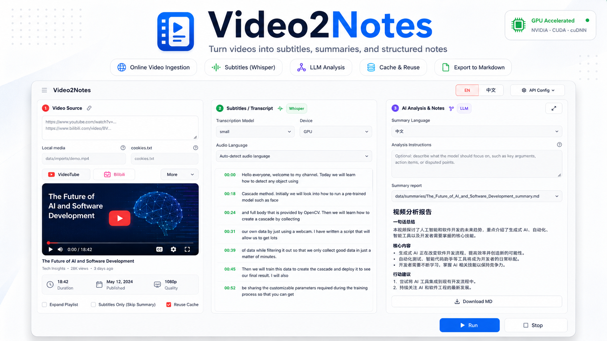

# Video2Notes

[](pyproject.toml)
[](LICENSE)

English | [简体中文](README.zh-CN.md)



## Overview

Video2Notes turns long videos into readable notes. It downloads or imports media, transcribes speech with Whisper, and generates Markdown analysis reports with OpenAI-compatible LLM APIs.

The project is designed for a local workflow: run the UI from the repository root, keep generated files under `data/`, and reuse cached audio, subtitles, and summaries when you rerun the same video.

## Feature

- Local Streamlit UI launched with `video2notes-ui`
- Bilibili, YouTube, and other `yt-dlp` supported video sources
- Browser `cookies.txt` support for sites that require login cookies
- Local audio or video import to skip online downloading
- Whisper transcription with `auto`, `cpu`, and `cuda` device modes
- Timestamped subtitle output, with `srt` as the default pipeline format
- OpenAI-compatible LLM analysis for Chinese or English notes
- Provider presets for OpenAI, SiliconFlow, DeepSeek, Qwen, OpenRouter, Ollama, and LM Studio
- Batch processing from pasted links or a relative URL file
- Relative-path artifact layout under `data/audio`, `data/subtitles`, `data/summaries`, and `data/metadata`
- Markdown report download from the UI

## Installation

Clone the repository and create a conda environment:

```bash
git clone https://github.com/jackwu925/video2notes.git
cd video2notes
conda create -n video2notes python=3.10 -y
conda activate video2notes
conda install -c conda-forge ffmpeg -y
python -m pip install -U pip
```

Install PyTorch before installing Video2Notes dependencies. Choose the PyTorch command that matches your operating system, package manager, CUDA version, and GPU driver from the official PyTorch install selector:

```text
https://pytorch.org/get-started/locally/
```

Do not copy a CUDA-specific Torch command unless it matches your local NVIDIA driver. CPU-only users can install the CPU build from the same selector.

After PyTorch is installed, install Video2Notes and its pinned runtime dependencies:

```bash
python -m pip install -r requirements.txt
```

Run all commands from the project root. `requirements.txt` installs the local checkout, so after activating conda you can start the web UI with:

```bash
video2notes-ui
```

Open the Streamlit URL printed in the terminal, configure your provider in `API Configuration`, paste a video link, and click `Run`.

For CLI-only usage without the web UI:

```bash
python -m pip install -e .
video2notes run "VIDEO_URL" --reuse-existing
```

For Bilibili video analysis, export your own browser cookies first. In Chrome, use the `Get cookies.txt LOCALLY` extension to save cookies as a relative file such as `cookies.txt`, then set that file in the UI `cookies.txt` field. Cookie files and generated data are ignored by git.

Generate subtitles only:

```bash
video2notes run "VIDEO_URL" --skip-llm
```

Use a local media file and skip downloading:

```bash
video2notes run --media-file data/imports/demo.mp4 --reuse-existing
```

Process multiple links from a relative file:

```bash
video2notes run --url-file data/urls.txt --reuse-existing
```

CLI LLM configuration can be provided with a local `.env` file. Create `.env` in the project root with your OpenAI-compatible provider settings:

```env
LLM_API_KEY=your_api_key
LLM_BASE_URL=https://api.openai.com/v1
LLM_MODEL=gpt-4o-mini
LLM_TIMEOUT_SECONDS=60
```

## License

Video2Notes is released under the [MIT License](LICENSE).
